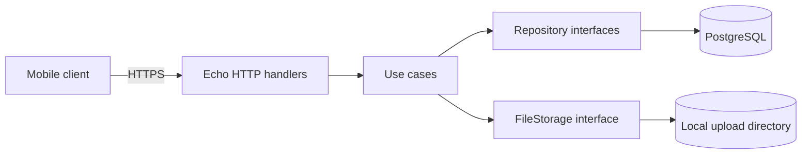

# Ticketing API

Educational, mobile-friendly ticketing backend built across eight phases.
Go + Echo + GORM + PostgreSQL, Clean Architecture, JWT auth, local-disk
attachments, in-app notifications, SLA basics.



## Phases & scope

| Phase | Adds |
|---|---|
| 1 | Bearer-token auth, session revocation |
| 2 | Categories + tickets + soft delete |
| 3 | Assignment, status workflow (`reopened` included), histories, scoped list |
| 4 | Comments + unified timeline |
| 5 | Admin category CRUD, classification endpoint, file attachments |
| 6 | `q` search, `view`, date range, strict `sort_by`, dashboard summary |
| 7 | SLA policies + derived ticket SLA, in-app notifications (sync, transactional) |
| 8 | `cmd/migrate`, `cmd/seed`, Dockerfile + compose, OpenAPI, CI, docs |

## Learning objectives

- Clean Architecture in Go (domain / use case / infrastructure / delivery).
- JWT auth and session revocation against a real database.
- Role-based access control enforced in the use-case layer.
- GORM repositories behind domain interfaces.
- Transactional writes coordinated through a domain `TxManager`.
- Multipart upload + safe local storage.
- Aggregate SQL queries for the dashboard.
- Derived SLA states + clock injection for testability.
- Synchronous notifications without a queue.
- Docker + migrations + seed for repeatable local development.

## Folder layout

```
cmd/
  api/       main API entrypoint
  migrate/   tiny SQL migration runner
  seed/      idempotent development fixtures
db/migrations/  *.up.sql / *.down.sql
docs/
  openapi.yaml
  deployment.md
  phase-NN-….md           (one per phase)
internal/
  config/                 env loader
  delivery/http/          Echo handlers + validator + middleware + routes
  domain/                 entities + repository/service interfaces + errors
  infrastructure/
    database/             GORM bootstrap
    migrator/             SQL runner (used by cmd/migrate)
    persistence/          GORM models + Postgres repository implementations
    security/             bcrypt + HS256 JWT
    storage/              local FileStorage
  usecase/
    auth/  user/  ticket/ rules, validation, role checks
scripts/                   verify_*.sh shell harnesses for end-to-end
api/                       .http manual API examples per phase
```

## Prerequisites

- Go 1.22+ (tested with 1.24)
- Either Docker, or a local PostgreSQL 16/18 client (`psql`)
- `jq` (only for the verify scripts)

## Local setup — without Docker

```bash
# 1) Start PostgreSQL however you like.
#    Create the DB and role the application expects:
psql -h localhost -U postgres -c "CREATE USER ticketing_user WITH PASSWORD 'ticketing_password';"
psql -h localhost -U postgres -c "CREATE DATABASE ticketing_db OWNER ticketing_user;"

# 2) Copy env defaults
cp .env.example .env

# 3) Apply migrations
make migrate-up

# 4) (Optional) Load 5 demo accounts + 4 sample tickets
make seed

# 5) Run the API
make run
```

API listens on `http://localhost:8080`. Health: `GET /health`.

## Local setup — with Docker Compose

```bash
docker compose up --build -d              # builds api image + boots postgres
docker compose run --rm api migrate up    # apply migrations inside the container
docker compose run --rm api seed          # idempotent demo data
```

Both `migrate` and `seed` are extra binaries baked into the image. The
Postgres data and uploads directory live in named volumes
(`ticketing_postgres_data`, `ticketing_uploads`) so they survive restarts.

## Migration & seed commands

```bash
# Inspect what's applied
go run ./cmd/migrate status

# Apply every pending migration (idempotent re-run)
go run ./cmd/migrate up

# Roll back the most-recent N migrations (defaults to 1)
go run ./cmd/migrate down [N]

# Insert dev fixtures
go run ./cmd/seed
```

## Development accounts (from `cmd/seed`)

| Role | Email | Password |
|---|---|---|
| admin | `admin@example.com` | `password123` (from `SEED_ADMIN_PASSWORD`) |
| agent | `agent1@example.com` | same |
| agent | `agent2@example.com` | same |
| customer | `user1@example.com` | same |
| customer | `user2@example.com` | same |

**Never use these in production.** See `docs/deployment.md`.

## API documentation

- Machine-readable: `docs/openapi.yaml` (OpenAPI 3.0.3).
- Per-phase deep dives: `docs/phase-NN-….md`.
- Manual `.http` files for JetBrains / VS Code REST Client:
  `api/phase_*.http` (one per phase).

## Representative cURL flow

```bash
# Login as customer
TOKEN=$(curl -sS -X POST http://localhost:8080/api/v1/auth/login \
  -H 'Content-Type: application/json' \
  -d '{"email":"user1@example.com","password":"password123"}' | jq -r '.data.access_token')

# List active categories
curl -sS http://localhost:8080/api/v1/categories -H "Authorization: Bearer ${TOKEN}" | jq

# Create a ticket
CAT=$(curl -sS http://localhost:8080/api/v1/categories \
  -H "Authorization: Bearer ${TOKEN}" | jq -r '.data[] | select(.slug=="technical-issue") | .id')
TICKET=$(curl -sS -X POST http://localhost:8080/api/v1/tickets \
  -H "Authorization: Bearer ${TOKEN}" -H 'Content-Type: application/json' \
  -d "$(jq -n --arg cat "$CAT" '{title:"Cannot log in", description:"App keeps saying unauthorized.", category_id:$cat, priority:"high"}')" \
  | jq -r '.data.id')

# Read the ticket — note the derived `sla` block
curl -sS http://localhost:8080/api/v1/tickets/$TICKET \
  -H "Authorization: Bearer ${TOKEN}" | jq '.data.sla'

# Dashboard summary
curl -sS http://localhost:8080/api/v1/dashboard/summary \
  -H "Authorization: Bearer ${TOKEN}" | jq
```

A scripted, role-rotating version of the same flow lives in
`scripts/demo_flow.sh`.

## Test & quality commands

```bash
make test       # go test ./...
make vet        # go vet ./...
make fmt        # gofmt -w .

# Per-phase live HTTP verification (each runs against a real API + DB)
make verify-auth          # Phase 1
make verify-tickets       # Phase 2 + 3
make verify-comments      # Phase 4
make verify-uploads       # Phase 5
make verify-search        # Phase 6
make verify-notifications # Phase 7
```

### Integration tests

Phases 1–7 are covered with use-case unit tests (fakes) plus a per-phase
`scripts/verify_*.sh` that runs against a real Postgres-backed API. For
an extra repository-level test run, point a separate database at the
project:

```bash
createdb ticketing_apps_test
TEST_DATABASE_URL=postgres://postgres@localhost:5432/ticketing_apps_test?sslmode=disable \
  go run ./cmd/migrate -dir db/migrations up
DATABASE_URL=$TEST_DATABASE_URL go run ./cmd/seed
DATABASE_URL=$TEST_DATABASE_URL make run &
sleep 1
make verify-tickets verify-comments verify-uploads verify-search verify-notifications
```

The shell verification suite exercises the same code paths a repository
integration test would, against an explicit second database.

## Upload storage notes

- Driver `local` only in Phase 8. The directory permission is `0700`; files
  are `0600`. The stored filename is `<uuid>.<ext>` with `ext` from a
  fixed MIME allow-list (PDF / JPEG / PNG / plain text). The client
  filename never reaches the filesystem path.
- Size cap defaults to **5 MiB** (`UPLOAD_MAX_SIZE_BYTES`).
- Downloads stream through the API, gated by the same `canViewTicket`
  helper used everywhere else. The raw storage path is never serialised.

## SLA simplifications

Phase 7 uses calendar minutes from ticket creation with the recommended
defaults (low 480/2880, medium 240/1440, high 60/480, urgent 15/120 — for
response / resolution targets). No working hours, no holidays. The
dashboard "due soon" window is 60 minutes. See
`docs/phase-07-sla-and-notifications.md` for the derivation tables.

## Security notes

- Bearer middleware sits on the `/api/v1` group; only `/health`,
  `POST /auth/register`, and `POST /auth/login` are public.
- Password hashes never leave the use-case layer.
- Storage paths never appear in JSON.
- All ticket visibility flows through a single `canViewTicket` helper.
- Customer query parameters cannot widen scope (`view=all` returns 422).
- Transactional writes coordinate ticket + history + notification +
  attachment-cleanup. Failed notifications roll back the trigger.

## Deployment checklist

See [`docs/deployment.md`](docs/deployment.md) for the full list.
Highlights:

- Replace `JWT_SECRET` with a random 32+ char value.
- Terminate TLS at a reverse proxy.
- Use managed PostgreSQL + backups.
- Local-file storage only works for a single persistent instance — replace
  the `FileStorage` driver with S3 before horizontal scaling.

## Optional advanced exercises

Beyond Phase 8 (not implemented):

- Refresh tokens, password reset, email verification.
- S3-compatible object storage.
- Email / SMS / push notification adapters.
- Redis caching.
- Queue-based notification delivery.
- WebSocket live updates.
- Audit-log exports.
- Multi-tenant organisations.
- Full-text search via Elasticsearch or `tsvector`.
- Observability (metrics + tracing).
